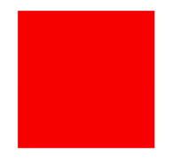
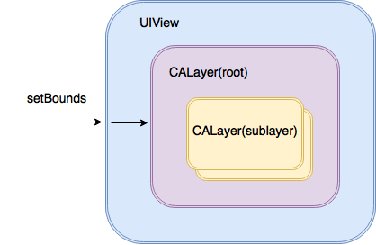
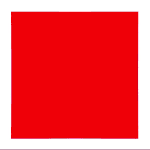
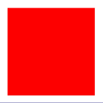
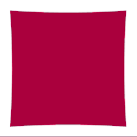

# Créer une "CALayer Animatable property" personalisée sur iOS

Si on peut bien accorder une chose à iOS c'est que son framework graphique ([`UIKit`](https://developer.apple.com/documentation/uikit)) est très bien pensé.

```swift
self.view.backgroundColor = UIColor.red
UIView.animate(withDuration: 1.0) {
	self.view.backgroundColor = UIColor.blue
}
```

Résultat:



Simple et efficace. Cool pas vrai ? ☺️

## Et si on créait notre propre proriété
Bien qu'`UIKit` nous donne un certains nombre de propriété "animable": `backgroundColor`, `frame`, `opacity`, `position` pour les plus connues.

[Voir la liste exhaustive ici](https://developer.apple.com/library/archive/documentation/Cocoa/Conceptual/CoreAnimation_guide/AnimatableProperties/AnimatableProperties.html)

Il serait intéressant de pouvoir en créer une nous même. Quelque chose dans ce genre là:

```swift
UIView.animate(withDuration: 1.0) {
	self.view.distortion = 1.0
}
```
Où la `distortion` serait une propriété qui déforme notre `UIView` et dont la valeur varie de `0.0` à `1.0`.

À noter que cette propriété serait pleinement compatible avec le framework `UIKit`, on pourrait donc s'amuser à faire des variations de la sorte sans problème.

```swift
UIView.animate(
	withDuration: 1.0,
	delay: 0.0,
	usingSpringWithDamping: 0.4,
	initialSpringVelocity: 0.6,
	options: [],
	animations: {
		self.view.distortion = 1.0
	}, completion: nil)
```

## 1. Commençons


Comme vous le savez une `UIView` s’occupe de la mise en page, de la gestion des événements tactiles. En revanche elle ne s’occupe pas directement du dessin ou des animations. `UIKit` délègue cette tâche à `CoreAnimation`. `UIView` est en fait juste un wrapper sur `CALayer`. Lorsque vous définissez une taille sur votre UIView, la vue définit simplement la taille sur sa couche de support `CALayer`. Si vous appelez `layoutIfNeeded` sur `UIView`, l’appel est transféré à la couche racine `CALayer`. Chaque `UIView` a une cocuhe `CALayer` racine, qui peut contenir des sous-couches.

Enfin un `CALayer` possède une propriété `presentationLayer` qui retourne une copie de lui même représentant l'état de la couche qui est actuellement affiché à l'écran (utile lors d'une animation par exemple).

## 2. Définissez votre "layer"

```swift
class DistortionLayer: CAShapeLayer {
    @NSManaged var distortion: CGFloat
    
    override init() {
        super.init()
    }
    
    override init(layer: Any) {
        super.init(layer: layer)
        if let layer = layer as? DistortionLayer {
            distortion = layer.distortion
        }
    }
    
    required init?(coder aDecoder: NSCoder) {
        super.init(coder: aDecoder)
    }
    
    private class func isCustomAnimKey(_ key: String) -> Bool {
        return key == "distortion"
    }
    
    override class func needsDisplay(forKey key: String) -> Bool {
        if self.isCustomAnimKey(key) {
            return true
        }
        return super.needsDisplay(forKey: key)
    }
    
    override func action(forKey event: String) -> CAAction? {
        if DistortionLayer.isCustomAnimKey(event) {
            if let animation = super.action(forKey: "backgroundColor") as? CABasicAnimation {
                animation.keyPath = event
                if let pLayer = presentation() {
                    animation.fromValue = pLayer.distortion
                }
                animation.toValue = nil
                return animation
            }
            setNeedsDisplay()
            return nil
        }
        return super.action(forKey: event)
    }
}
```

## 3. Définissez votre vue
```swift
class DistortionView: UIView {
    var distortion: CGFloat {
        set {
            if let layer = layer as? DistortionLayer {
                layer.distortion = newValue
            }
        }
        get {
            if let layer = layer as? DistortionLayer {
                return layer.distortion
            }
            return 0.0
        }
    }
    
    override class var layerClass: AnyClass {
        return DistortionLayer.self
    }
    
    override func display(_ layer: CALayer) {
        if let pLayer = layer.presentation() as? DistortionLayer {
            
            if let castLayer  = layer as? CAShapeLayer{
                let width = frame.width
                let height = frame.height
                let distortionValue = (max(width, height)/8) * pLayer.distortion
                let x0 = CGPoint(x: 0, y: 0)
                let p0 = CGPoint(x: width/2, y: 0 + distortionValue)
                let x1 = CGPoint(x: width, y: 0)
                let p1 = CGPoint(x: width - distortionValue, y: height/2)
                let x2 = CGPoint(x: width, y: height)
                let p2 = CGPoint(x: width/2, y: height - distortionValue)
                let x3 = CGPoint(x: 0, y: height)
                let p3 = CGPoint(x: 0 + distortionValue, y: height/2)
                
                let path = UIBezierPath()
                path.move(to: x0)
                path.addQuadCurve(to: x1, controlPoint: p0)
                path.addQuadCurve(to: x2, controlPoint: p1)
                path.addQuadCurve(to: x3, controlPoint: p2)
                path.addQuadCurve(to: x0, controlPoint: p3)
                path.close()
                
                let maskShape = CAShapeLayer()
                maskShape.path = path.cgPath
                
                castLayer.mask = maskShape
            }
        }
    }
}
```

## 4. Animez votre propriété

Résultat:



```swift
self.distortionView.backgroundColor = UIColor.red
self.distortionView.distortion = 0
UIView.animate(withDuration: 2.0) {
	self.distortionView.backgroundColor = UIColor.blue
	self.distortionView.distortion = 1
}
```
--
Résultat:



```swift
self.distortionView.backgroundColor = UIColor.red
self.distortionView.distortion = 0
UIView.animate(withDuration: 1.0,
	delay: 0.0,
  	usingSpringWithDamping: 0.4,
    initialSpringVelocity: 0.6,
    options: [],
    animations: {
		self.distortionView.distortion = 1
		self.distortionView.backgroundColor = UIColor.blue
}, completion: nil)
```

--
Résultat:



```swift
self.distortionView.backgroundColor = UIColor.red
self.distortionView.distortion = 0
UIView.animate(withDuration: 0.3,
				 delay: 0.0,
  				 options:[.curveEaseOut, .autoreverse],
				 animations: {
					self.distortionView.distortion = 1         
					self.distortionView.backgroundColor = UIColor.blue
},completion: { finished in
		if finished == true {
			self.distortionView.distortion = 0
			self.distortionView.backgroundColor = UIColor.red
		}
})
```